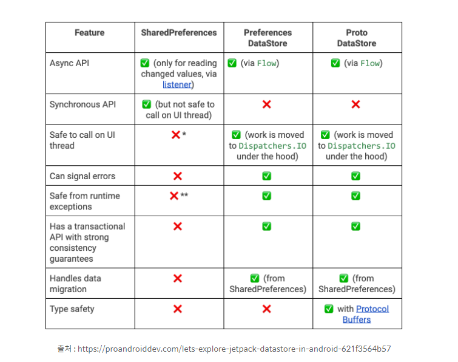

## DataStore

### DataStore가 뭔가요?
키-값 쌍 또는 유형이 지정된 객체를 저장할 수 있는 데이터 저장소 솔루션 이다. 코루틴 및 Flow를 사용하여 비동기적이고 일관된 트랜잭션 방식으로 데이터를 저장하는 것이 특징이라 볼수 있다.  
DataStore는 키 - 값 으로 구성되어 있는 Preferences DataStore , 사용자가 정의한 데이터를 저장할 수 있는 Proto DataStore가 존재한다.

### DataStore의 장점

딱 봐도 우리가 기존에 쓰던 [SharedPreferences](Andoroid/../SharedPreferences.md)보다 좋은걸 알수 있다.

- 장점 1.
    - DataStore는 코루틴과 Flow를 통해 읽고 쓰기에 대한 비동기 API를 제공한다.
- 장점 2.
    - DataStore는 UI 스레드를 호출해도 안전합니다. ( Dispather.IO 밑에서 작동하기 때문에 )
- 장점 3.
    - runtime exception으로부터 안전합니다.