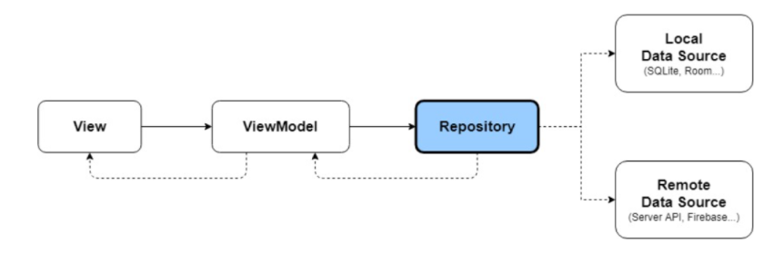

## Repository Pattern
---
#### Repository Pattern?
- 데이터 출처(로컬DB인지 API인지)와 관계 없이 동일 인터페이스로 접속할 수 있도록 만드는것 (하나의 인터페이스로 여러 데이터에 접근할수 있게 해주는것)
- 데이터 관련 로직을 완전히 분리하는 기법

#### 사용하는 이유
1. 데이터 로직을 분리 시킬수 있다.
    - 때문에 새로운 데이터 로직 코드를 쉽게 추가할수 있다
        - 유지 보수 편리
  
2. 중앙 집중처리 방식 -> 언제나 일관된 인터페이스로 데이터를 요청할 수 있음
3. 가져올 데이터를 Repository에서 결정함
-> 클라이언트가 사용할 데이터를 결정할 필요 X

#### 장점
1. 데이터가 새롭게 추가되는 것에 대한 부담이 없다
2. 테스트 하기 쉽다

#### 단점
1. 관리해야할 파일, 코드가 많아진다

#### 구조
- View > ViewModel > Repository > DataSource(API, LocalDB)
>
  
  
