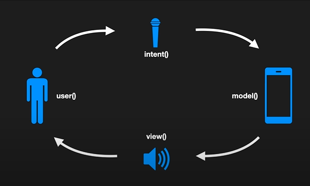

## MVI
#### 우리가 만드는 앱의 문제?
```
우리가 만드는 앱의 문제는 상태다!
```
1. 상태의 충돌
<br>상태가 왜 문제일까? 예를 들어 설명해주겠다<br>
```
- MSG 앱에서 동아리 디테일 페이지를 들어갔는데 데이터가 표시됬지만 프로그래스 바가 계속해서 돈다
```
위와 같은 상황이 바로 상태의 충돌이다

2. 발생 원인?
- 그럼 이 상태의 충돌이 일어나는 원인이 무었일까?
- 1. 분산된 데이터
    - 화면에 표시해야할 데이터가 view,viewmodel, model 등에 분산되어 관리 될때 세심하게 관리 하지 않으면 상태의 충돌이 발생할수 있다
- 2. 복잡한 데이터 흐름
    - 여러 비동기 작업(네트워크 통신, 복잡한 데이터 처리등)이 섞여서 서로 앱의 상태를 변화 시키려 시도할때도 상태의 충돌이 발생할수 있다

#### MVI 
- MVI는 위와 같은 상태의 충돌을 피하고 데이터 흐름을 추적하기 쉬운 구조의 앱을 목표로 하는 디자인 패턴 
- 상태는 하나의 불변 객체로 사용
- 데이터의 흐름은 단방향으로만 <br>
<br>
- 각 함수가 결과값을 계속 넘겨주면서 순환 하는 구조<br>
<br>
의도 -> 앱의 변화를 일으킬려는 의지
- 이벤트나 액션등을 의미함
- 뷰함수는 리턴값이 없다, 화면에 상태에 맞는 뷰를 렌더링 한다
- 그 뷰를 유저가 보게되고 유저가 추가 작업을 요구하면 intent부터 사이클이 돌게 되는 구조이다<br><br>
정리하자면 MVI는 의도를(intent) 상태로 만들어(Model)표시하는것(View)이다.
#### MVI 을 써야하는 이유?
1. 유의미한 테스트의 가능
2. 디버깅이 쉽다
3. 누가 개발하더라도 일정한 수준 이상의 결과물이 보장된다?
- 3번을 보고 의아해 할수 있다, 하지만 MVI라면 가능하다
    - MVI는 각각의 역할이 명확하기 때문 
    - intent와 view는 개인의 역량에 따라 구조적인 문제가 발생하기 어렵다
    - model만 정규화 시킬수 있다면 3번 조건을 충족할수 있다.
#### Box
- MVI아키텍쳐로 안드로이드 앱을 개발할수 있도록 도와주는 프레임 워크
<br><br>
Box의 블루 프린트
- 일반적인 MVI 아키텍쳐를 바탕으로 Intent처리와 Model 생성을 정규화 시키기 위한것
- 이름그대로 앱의 설계도 역할을 함
- 앱에서 발생하는 이벤트와 앱의 상호 관계를 DSL로 선언해두면 나머지는 Box가 알아서 처리해줌

#### SideEffect 
- mvi에 있는 알아야 하는 개념중 한가지 이다 
- 사용자의 의도를 즉각적으로 앱의 상태로 바꾸어 주지 못하는 작업들을 이 개념으로 처리한다
- 시간이 오래걸리는 background작업이나 api통신, 토스트나 다이얼로그 등을 말한다<br><br>
<br>
- sidEffect가 추가된 MVI의 사이클
- 사용자의 의도가 상태가 될때 필요에 따라서 sideEffect가 실행된다
- 원래의 MVI 사이클과 무관하게 처리된 sideEffect는 작업이 끝난후 새 Intent가 되어 다시 사이클에 합류 할수 있다.