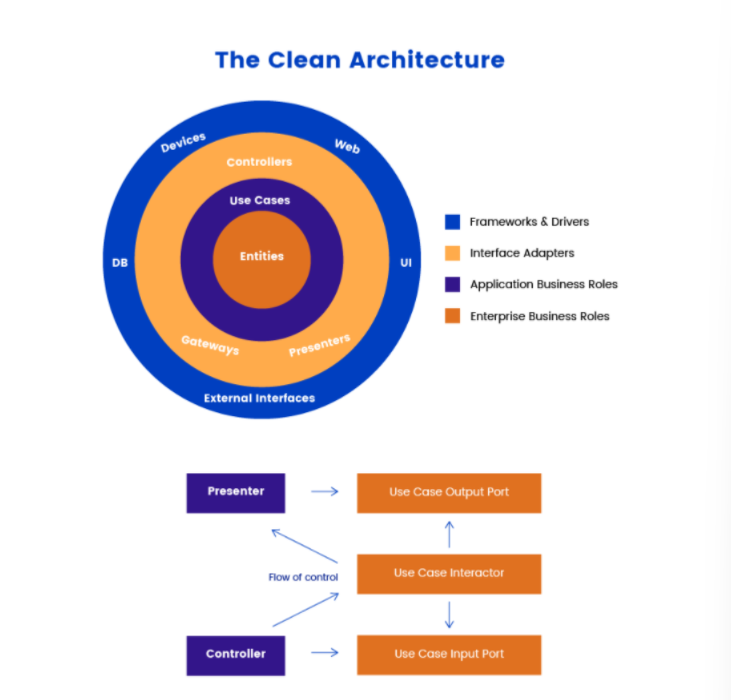

## CleanArchitecture?
---
#### CleanArchitecture의 등장
- 애플리케이션은 고객의 요구 사항을 충족 할 뿐만 아니라 유연하고 테스트가 가능하며 유지보수가 가능해야 한다. 이러한 문제를 해결하기 위해 Robert C. Martin라는 분이 2012 년에 Clean Architecture 개념을 제시했다.
  
#### CleanArchitecture의 구조 및 특징

---
클린 아키텍쳐의 구조는 위와 같이 총 4가지 계층으로 이루어져 있다.
이렇게 계층을 나누는 이유는 관심사를 분리시키기 위해서 이며 이런 아키텍쳐가 동작하기 위해서는 의존성 규칙을 지켜야 한다는걸 의미한다  
- 한마디로 각 분리된 클래스가 한가지 역할만 하고 서로 어떻게 의존할지 큐칙이 정해져있고 그 규칙을 따라야 한다는 말이다.
- 안드로이드를 예로들면 비즈니스 로직을 담당하는 ViewModel과 같은 코드를이 DB 또는 Web 같은 세부 사항에 의존하지 않아야 한다 
    - 이를 통해 비즈니스로직은 세부사항들의 변경에 영향을 받지 않도록 할 수 있다.
#### CleanArchitecture를 사용하므로써 얻는 장점
- 테스트를 가능하게 해준다
- 유지보수 및 협업이 쉬워진다
- 새 기능을 빠르게 적용할수 있다
- 이후의 개발에도 안정적으로 구현할수 있다
#### CleanArchitecture의 각 계층에 대한 설명
1. Entities
    - 비즈니스 규칙을 캡슐화하고 DTO도 포함하는 전사적 비즈니스 규칙이다. 외부가 변경되면 이런 규칙이 변경될 가능성이 가장 적다
2. Use cases
    - Intereator라고도 하며 소프트웨어의 애플리케이션 별 비즈니스 규칙을 나타낸다, 이 계층은 데이터베이스, 공통 프레임 워크 및 UI에 대한 변경으로부터 격리된다
3. Interface Adapters (Presenters)
    - 인터페이스 어댑터는 데이터를 Entity 및 UseCase의 편리한 형식에서 데이터베이스 및 웹에 적용 할수있는 형식으로 변환해준다, 순수한 비즈니스 로만을 담당하는 역할을 하게된다
4. Frameworks $ Drivers (Web,DB) 
    - 프레임워크와 드라이버는 웹 프레임 워크, 데이터베이스, UI, HTTP 클라이언트 등으로 구성된 가장 바깥 쪽 계층입니다.

>클린 아키텍쳐에 대해 공부해 봤는데 이해 안되는 부분이 많다 계속 공부해야겠다